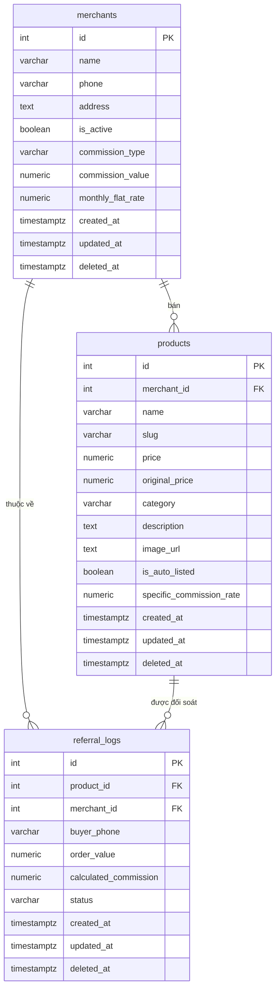

# Semantic Knowledge Base — Database Schema Facts

Tài liệu này lưu trữ các sự thật cấu trúc (schema facts) và chính sách bảo mật (RLS) của cơ sở dữ liệu PostgreSQL (Supabase) của dự án Hải Sản Cà Mau. Tất cả các thay đổi schema hoặc truy vấn SQL sau này phải tuân thủ tài liệu này.

---

## 1. Sơ Đồ Thực Thể & Quan Hệ (ERD facts)

---

## 2. Chi Tiết Cấu Trúc Các Bảng (Table Schemas)

### 2.1 Bảng `merchants` (Vựa Hải Sản)
Lưu trữ thông tin đối tác thương lái cung cấp hải sản.

*   **Trường dữ liệu:**
    *   `id` (`SERIAL PRIMARY KEY`): Định danh tự tăng.
    *   `name` (`VARCHAR(255) NOT NULL`): Tên vựa hải sản.
    *   `phone` (`VARCHAR(20) NOT NULL`): Số điện thoại liên hệ.
    *   `address` (`TEXT`): Địa chỉ vựa hải sản.
    *   `is_active` (`BOOLEAN DEFAULT TRUE NOT NULL`): Trạng thái hoạt động.
    *   `commission_type` (`VARCHAR(20) DEFAULT 'percentage' NOT NULL`): Loại hoa hồng đối soát.
    *   `commission_value` (`NUMERIC(10, 2) DEFAULT 5.00 NOT NULL`): Giá trị hoa hồng tương ứng.
    *   `monthly_flat_rate` (`NUMERIC(10, 2) DEFAULT 0.00 NOT NULL`): Phí cố định hàng tháng (nếu áp dụng loại phí phẳng).
    *   `created_at`, `updated_at` (`TIMESTAMPTZ DEFAULT CURRENT_TIMESTAMP NOT NULL`).
    *   `deleted_at` (`TIMESTAMPTZ DEFAULT NULL`): Dùng cho Soft Delete.

*   **Ràng buộc (Constraints):**
    *   `chk_merchants_commission_type`: `CHECK (commission_type IN ('percentage', 'fixed', 'monthly_flat'))`

*   **Chỉ mục (Indexes):**
    *   `idx_merchants_active`: `CREATE INDEX idx_merchants_active ON merchants (is_active) WHERE deleted_at IS NULL` (Tối ưu tìm kiếm vựa đang hoạt động).

---

### 2.2 Bảng `products` (Sản Phẩm)
Lưu trữ thông tin hải sản (Tôm sú, Cua biển, mực, v.v.).

*   **Trường dữ liệu:**
    *   `id` (`SERIAL PRIMARY KEY`): Định danh tự tăng.
    *   `merchant_id` (`INT NOT NULL`): Liên kết sang bảng `merchants`.
    *   `name` (`VARCHAR(255) NOT NULL`): Tên sản phẩm (VD: "Cua Gạch Cà Mau Hộp 1kg").
    *   `slug` (`VARCHAR(255) NOT NULL`): Đường dẫn URL chuẩn SEO (Unique).
    *   `price` (`NUMERIC(10, 2) NOT NULL`): Giá bán hiện tại.
    *   `original_price` (`NUMERIC(10, 2)`): Giá gốc (dành cho hiển thị giảm giá).
    *   `category` (`VARCHAR(100)`): Danh mục sản phẩm (tom-su, cua-bien, dac-san-kho).
    *   `description` (`TEXT`): Mô tả sản phẩm.
    *   `image_url` (`TEXT`): Ảnh sản phẩm.
    *   `is_auto_listed` (`BOOLEAN DEFAULT TRUE NOT NULL`): Tự động hiển thị.
    *   `specific_commission_rate` (`NUMERIC(5, 2) DEFAULT NULL`): Hoa hồng đặc thù cho sản phẩm (nếu ghi đè mức chung của vựa).
    *   `created_at`, `updated_at` (`TIMESTAMPTZ DEFAULT CURRENT_TIMESTAMP NOT NULL`).
    *   `deleted_at` (`TIMESTAMPTZ DEFAULT NULL`): Soft Delete.

*   **Ràng buộc (Constraints):**
    *   `uniq_products_slug`: `UNIQUE (slug)`
    *   `fk_products_merchants`: `FOREIGN KEY (merchant_id) REFERENCES merchants(id) ON DELETE RESTRICT`

*   **Chỉ mục (Indexes):**
    *   `idx_products_slug` (`slug`): Tìm kiếm sản phẩm chuẩn SEO.
    *   `idx_products_merchant_id` (`merchant_id`): Tối ưu truy vấn JOIN vựa.
    *   `idx_products_active` (`deleted_at`): Tối ưu lọc sản phẩm chưa bị xoá.

---

### 2.3 Bảng `referral_logs` (Nhật Ký Đối Soát Hoa Hồng)
Ghi nhận các lượt click, đăng ký mua hàng chuyển đổi thành hoa hồng cho vựa.

*   **Trường dữ liệu:**
    *   `id` (`SERIAL PRIMARY KEY`).
    *   `product_id` (`INT NOT NULL`): Khóa ngoại liên kết bảng `products`.
    *   `merchant_id` (`INT NOT NULL`): Khóa ngoại liên kết bảng `merchants`.
    *   `buyer_phone` (`VARCHAR(20)`): Số điện thoại người mua.
    *   `order_value` (`NUMERIC(10, 2)`): Tổng giá trị đơn hàng.
    *   `calculated_commission` (`NUMERIC(10, 2) NOT NULL`): Số tiền hoa hồng tính toán được.
    *   `status` (`VARCHAR(20) DEFAULT 'pending' NOT NULL`): Trạng thái thanh toán/đối soát.
    *   `created_at`, `updated_at` (`TIMESTAMPTZ DEFAULT CURRENT_TIMESTAMP NOT NULL`).
    *   `deleted_at` (`TIMESTAMPTZ DEFAULT NULL`): Soft Delete.

*   **Ràng buộc (Constraints):**
    *   `chk_referral_logs_status`: `CHECK (status IN ('pending', 'completed', 'cancelled'))`
    *   `fk_referral_logs_products`: `FOREIGN KEY (product_id) REFERENCES products(id) ON DELETE RESTRICT`
    *   `fk_referral_logs_merchants`: `FOREIGN KEY (merchant_id) REFERENCES merchants(id) ON DELETE RESTRICT`

*   **Chỉ mục (Indexes):**
    *   `idx_referral_logs_product_id` / `idx_referral_logs_merchant_id`: Tối ưu JOIN.
    *   `idx_referral_logs_status` / `idx_referral_logs_created_at`: Tối ưu đối soát định kỳ.
    *   `idx_referral_logs_active` (`deleted_at`): Soft Delete.

---

## 3. Chính Sách Bảo Mật Cấp Hàng (Row Level Security - RLS)

Dự án áp dụng RLS mặc định trên tất cả các bảng để kiểm soát quyền truy cập trực tiếp từ API Supabase.

1.  **Bảng `merchants`:**
    *   *Trạng thái:* `ENABLE ROW LEVEL SECURITY`
    *   *Chính sách:* `Allow public read access to merchants`
    *   *Quy tắc:* Cho phép Anonymous (`anon`) và Authenticated đọc (`SELECT`) nếu vựa đang hoạt động (`is_active = true`) và chưa bị xóa mềm (`deleted_at IS NULL`).
2.  **Bảng `products`:**
    *   *Trạng thái:* `ENABLE ROW LEVEL SECURITY`
    *   *Chính sách:* `Allow public read access to products`
    *   *Quy tắc:* Cho phép Anonymous (`anon`) và Authenticated đọc (`SELECT`) nếu sản phẩm chưa bị xóa mềm (`deleted_at IS NULL`).
3.  **Bảng `referral_logs`:**
    *   *Trạng thái:* `ENABLE ROW LEVEL SECURITY`
    *   *Chính sách:* Không có chính sách public. Mọi hoạt động ghi log hoặc đọc log đối soát bắt buộc phải đi qua server-side connection (Sử dụng Service/Repository layer với Service Role key có quyền admin hoặc qua kết nối Postgres trực tiếp bảo mật).
